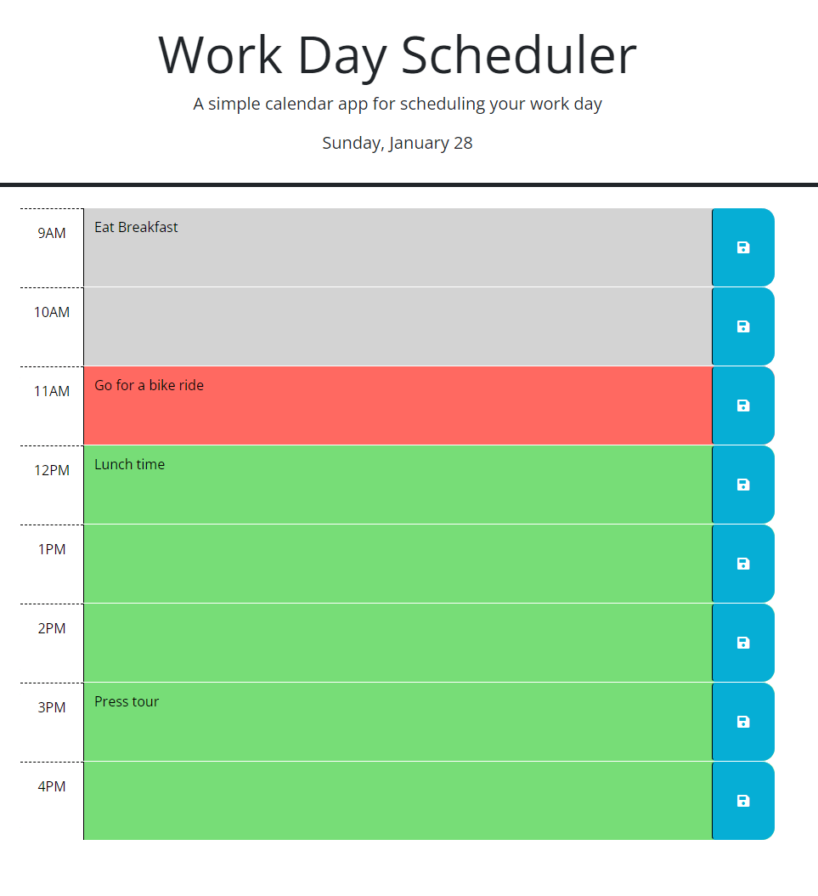

# Work Day Scheduler (Module-5-Challenge)

## Description 
Deployed site: https://jheersink8.github.io/module-5-challenge/ 

When I approached this project, I tried to envision that a client had commissioned me to build this site and implement their user story. With that approach in mind, I was able to not just build the minimum requested content, but I also thought through some potential problems the client may have missed as well as compiling a list of things they should think through for future development. I’ll highlight some of the specific additions below, but my biggest takeaway with this project was how I could ask the question, “what is the client not thinking about?” With that approach, I believe I was able to deliver a good product for them. Some of the technical things I learned through this project include (but are not limited to): 

- Integrating time (dayJS) with logic functions
- Utilizing shortcuts that come with jQuery
- Building HTML content that the user will see entirely from JavaScript
- Making the entire script page dynamic to react to a few variables 
- Navigating the DOM with jQuery syntax 

## Usage

The functionality matches all the client’s requested features. The date is displayed at the top of the page. They can click any text area, add content, and save it by clicking the button. When they reload the page, the content will persist. Also, the colors of the cells reflect the past (grey blocks), the present (red blocks), and the future (green blocks). Below is a screenshot of what the scheduler looks like. 
In addition to the minimum features listed above, I added some additional features to provide a stronger experience for the end users: 

-	The display of content for the end user is highly dynamic. By this, I mean that if the end user wanted to add times outside of their set boundaries of 9:00AM – 5:00PM, they can easily do that. The first two lines of JS code represent the start time for the scheduler and the end time represents the end time for the scheduler. The end user would just need to change these parameters to add/subtract time slots. And the reset of the page is dynamic enough to react to these two changed variables; no other content needs to be changed by the end user. 

-	Any event that is tagged with a past color code of grey will be changed to read only. This way, the users will have a protected/unaltered history as they move throughout the day. 

Some other considerations that the end user may want in future requests: 

-	Request to have the page automatically change the highlighted text areas automatically at the top of each hour. Since this wasn’t a direct request from the end user and not 100% necessary for a good experience, I (the developer) did not add it. 

-	Similarly, it may be a good idea to add the ability to clear all local saved content at 11:59PM each night so that the schedule is blank and ready to use the next day. 

## Credits
The original scenario was presented by Denver University in the Bootcamp course ID DU-VIRT-FSF-PT-12-2023-U-LOLC-MWTH under Module 5 Challenge. The starter HTML and CSS code was presented by DU and all remaining code was generated and submitted by Jordan R. Heersink.

## License 
MIT License Copyright (c) 2024 Jordan Heersink Permission is hereby granted, free of charge, to any person obtaining a copy of this software and associated documentation files (the "Software"), to deal in the Software without restriction, including without limitation the rights to use, copy, modify, merge, publish, distribute, sublicense, and/or sell copies of the Software, and to permit persons to whom the software is furnished to do so, subject to the following conditions: The above copyright notice and this permission notice shall be included in all copies or substantial portions of the Software. THE SOFTWARE IS PROVIDED "AS IS", WITHOUT WARRANTY OF ANY KIND, EXPRESS OR IMPLIED, INCLUDING BUT NOT LIMITED TO THE WARRANTIES OF MERCHANTABILITY, FITNESS FOR A PARTICULAR PURPOSE AND NONINFRINGEMENT. IN NO EVENT SHALL THE AUTHORS OR COPYRIGHT HOLDERS BE LIABLE FOR ANY CLAIM, DAMAGES OR OTHER LIABILITY, WHETHER IN AN ACTION OF CONTRACT, TORT OR OTHERWISE, ARISING FROM, OUT OF OR IN CONNECTION WITH THE SOFTWARE OR THE USE OR OTHER DEALINGS IN THE SOFTWARE.